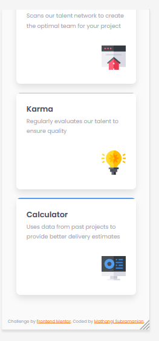

# Frontend Mentor - Four card feature section solution

This is a solution to the [Four card feature section challenge on Frontend Mentor](https://www.frontendmentor.io/challenges/four-card-feature-section-weK1eFYK). Frontend Mentor challenges help you improve your coding skills by building realistic projects. 

## Table of contents

- [Overview](#overview)
  - [The challenge](#the-challenge)
  - [Screenshot](#screenshot)
  - [Links](#links)
- [My process](#my-process)
  - [Built with](#built-with)
  - [What I learned](#what-i-learned)
  - [Continued development](#continued-development)
  - [Useful resources](#useful-resources)
- [Author](#author)
- [Acknowledgments](#acknowledgments)

## Overview
### The challenge

Users should be able to:

- View the optimal layout for the site depending on their device's screen size

### Screenshot

### 
Desktop view
 

### 
Mobile View
 

# 
### Links

- Solution URL : [Git URL](https://github.com/mathangisd/four-card-feature-section.git)

- Live URL : [Four Card Feature Section on Netlify](https://four-card-feature-msd.netlify.app/)

## My process
### Built with

- Semantic HTML5 markup
- CSS custom properties
- CSS Grid

### What I learned

I learned how to use auto-fit keyword and minmax function to make the design more responsive without using media query. Also I specified grid area using grid-lines to make it match with the given desktop design. I also used the ::after pseduo-element to draw the top border and set the overflow to hidden to get the specific border shape in the design.

### Continued-Development
I would like to work on projects with different layouts and focus on making them responsive.

### Useful resources

-[Flexible layouts without media queries](https://blog.logrocket.com/flexible-layouts-without-media-queries/) by Dannie Vinther

-[Moving Items in CSS Grid Layout [Guide](https://www.hongkiat.com/blog/moving-css-grid-items/) by Preethi Ranjit

## Author
- Website - [Mathangi Subramanian](https://github.com/mathangisd)
- Frontend Mentor - [mathangisd](https://www.frontendmentor.io/profile/mathangisd)

## Acknowledgments
Thank you to anyone for giving any feedback, it is always helpful to know how the code could be improved.